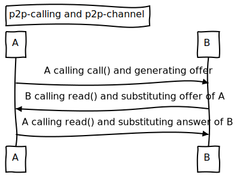
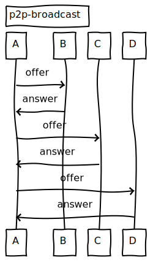

# socketless WebRTC

```
v=0
o=- 1400031703579285934 2 IN IP4 127.0.0.1
s=-
t=0 0
a=group:BUNDLE audio video
a=msid-semantic: WMS w3MejdSb5gzuDjVSDtkCrNqJyO6qshOKKYRt
m=audio 9 UDP/TLS/RTP/SAVPF 111 103 104 9 0 8 106 105 13 110 112 113 126
c=IN IP4 0.0.0.0
a=rtcp:9 IN IP4 0.0.0.0
a=ice-ufrag:BCa/
a=ice-pwd:YXIJJf4+B/IALDC63DQC/rc7
a=ice-options:trickle
a=fingerprint:sha-256 11:33:A2:90:61:90:29:CC:75:4C:11:7F:3D:54:7B:0C:C1:FB:9A:AC:95:2D:4F:78:A9:C2:79:F2:3F:DC:B9:2B
a=setup:actpass
a=mid:audio
a=extmap:1 urn:ietf:params:rtp-hdrext:ssrc-audio-level
a=sendrecv
a=rtcp-mux
a=rtpmap:111 opus/48000/2
a=rtcp-fb:111 transport-cc
...
```

#### SDP Protocol

> https://myungjaeyu.github.io/socketless-webrtc-poc/sdp.html

---



#### p2p-calling

> https://myungjaeyu.github.io/socketless-webrtc-poc/p2p-calling.html

#### p2p-channel

> https://myungjaeyu.github.io/socketless-webrtc-poc/p2p-channel.html



`broadcaster A`

`viewers B, C, D`

#### p2p-broadcast

> https://myungjaeyu.github.io/socketless-webrtc-poc/p2p-broadcast.html